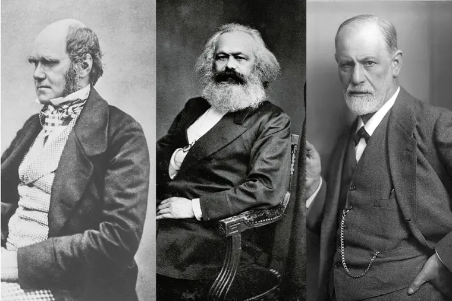
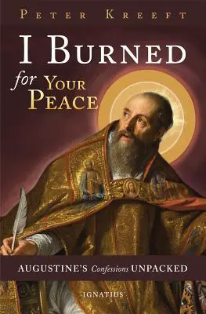

# [奥古斯丁《忏悔录》之随想] 占星术之惑，及其三种现代版本

> \[占星家们\]教导说：“你犯罪的因由在于天，是出于天命，是不可避免的；是金星、或土星、或火星所为。”换句话说，人，有血有肉，骄傲堕落，是无罪的；罪责乃在于天上日月星辰的创造者和主治者。

> 奥古斯丁，《忏悔录》卷四，第三章

古代的迦太基与任何一座现代都市都很相像，而奥古斯丁在那里寻得、崇拜的许多偶像与我们现今所崇拜的无异（性、娱乐、教育、意识形态、虚假宗教）。虽然时过境迁，终极之问仍然相同（是什么赋予了人类生命以意义和目的？），而诸多试图作出的终极之答也仍旧相同。占星术就是其一。

如今，那种字面意义上的占星术已经不像奥古斯丁时代那样盛行了，然而盛行却是它的三个更复杂和所谓科学的版本：达尔文主义、马克思主义和弗洛伊德主义。所有这些都给了人类与占星术完全相同的所谓好处或回报：洗脱罪责（exculpation of guilt）。这三种现代理论的本质与占星术的宿命论是一样的：“人，有血有肉，骄傲堕落，是无罪的。”

达尔文主义者告诉我们，我们模仿猿人，不是因为我们邪恶，而是因为我们是它们的众子，而不是神的众子。

马克思主义者告诉我们，没有个人性的罪，只有经济体的罪；我们的过错不过是我们资本主义制度的过错。

弗洛伊德主义者告诉我们，我们不过是“本我”(id)，而不是“自我”（ego）；是“它”（it），而不是“我”(I)；是利比多（libido，或译作“性欲”）之河，而不是一个有理性和自由意志，能在这条河上掌舵的人。

占星术仍然在掌权；唯一的区别是那众星已落到了地上。

* * *

(译自Peter Kreeft, I Burned for Your Peace - Augustines Confessions Unpacked  )

彼得．克里夫特（Peter Kreeft）：波士顿学院哲学系教授，著作超过四十部，当中不乏畅销书，题材广泛，如灵修学、哲学、护教学、伦理、《圣经》研究等，包括《天堂一内心深处的渴望》（Heaven, the Heart's Deepest Longing）、《重寻美德》（Back to Virtue）、《你也可以明白圣经》（You Can Understand the Bible）、《天使与魔鬼》（Angels and Demons）、《哲学101》（Philosophy 101）及《神学大全中的大全》（Summa of the Summa）等

版权所有：2016 Peter Kreeft

翻译版权：2022 张云轩

欢迎转发朋友圈。未经许可，请勿转载。

