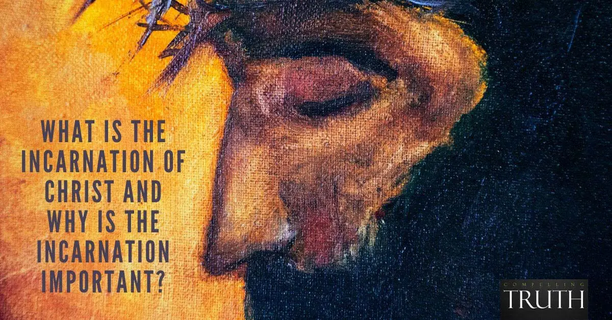

# [圣诞真义] - 关于道成肉身的历代撷思

编者按：

当我们庆祝圣诞时，我们在庆祝什么？圣诞节仅仅关于圣诞树、圣诞老人和放在长袜中的礼物吗？或许，我们需要拨开（现代、商业主义）文化的迷雾，借助历史上那些详细查考过圣诞事件之人的智慧之言，一窥圣诞节的真义——圣诞节乃是记念在两千年前降世为人的造物主和救主……

* * *

“基督在永恒中靠在天父的怀抱中没有母亲，在时间中靠在女人的怀抱中没有父亲。这女人紧紧抱着成为今世婴孩的亘古常在者。多么深的下降：

•从荣耀的至高处来到了耻辱的至深处；

•从奇妙的高天降到邪恶盘踞之地；

•从高举到屈辱；

•从宝座到那木头上；

•从尊严到卑贱；

•从崇拜到忿怒；

•从天庭到钉子；

•从冠冕到诅咒；

•从荣耀之地到血腥之地!

在伯利恒，卑贱和荣耀在极端中联合。生在马厩! 以牛槽作摇篮! 裹在贫穷的襁褓里! 所有空间由他创造，却没有空间留给他! 他创造、知晓万方，却没有地方容纳他! 哦，造物主从被造的女人而出——何等的降卑! 但在他的下降中，怜悯的曙光出现。因为我们不能升到他那里去，他就降到我们这里来。”——R. G. 李

Christ who in eternity rested motherless upon the Father’s bosom and in time rested fatherless upon a woman’s bosom, clasping the Ancient of Days who had become the Infant of Days. What deep descent:

•from the heights of glory to the depths of shame;

•from the wonders of Heaven to the wickedness of earth;

•from exaltation to humiliation; from the throne to the tree;

•from dignity to debasement; from worship to wrath;

•from the halls of Heaven to the nails of earth;

•from the coronation to the curse;

•from the glory place to the gory place!

In Bethlehem, humility and glory in their extremes were joined. Born in a stable! Cradled in a cattle trough! Wrapped in swaddling clothes of poverty! No room for Him who made all rooms! No place for Him who made and knows all places! Oh, deep humiliation of the Creator—born of the creature, woman! But in His descent was the dawn of mercy. Because we cannot ascend to Him, He descends to us.– R.G. Lee

“是的，在我们的世界里也是如此，一个马厩里曾经装着比我们整个世界还大的东西。”——《纳尼亚传奇·最后一战》中的露西女王

“Yes, in our world too, a stable once had something inside it that was bigger than our whole world.” – Queen Lucy in the Last Battle, Chronicles of Narnia

“无限，却是一个婴儿。永恒，却由女人所生。全能，却挂在女人胸前。托住万有，却需要被母亲怀抱。是众天使的王，却被称为约瑟的儿子。将要继承万有，却又是让人瞧不起的木匠的儿子。”——查尔斯·司布真

“Infinite, and an infant. Eternal, and yet born of a woman. Almighty, and yet hanging on a woman’s breast. Supporting a universe, and yet needing to be carried in a mother’s arms. King of angels, and yet the reputed son of Joseph. Heir of all things, and yet the carpenter’s despised son.”– Charles Spurgeon

"我不认为基督单单是神，或单单是人，而是两者皆是。因为我知道他会饿，我也知道他用五个饼喂饱了五千人。我知道他会渴，我也知道他把水变成了酒。我知道他被船载着，我也知道他在海面上行走。我知道他死了，我也知道他使死人复活。我知道他被押到彼拉多面前，我也知道他与天父一同坐在宝座上。我知道他被天使敬拜，我也知道他被犹太人弃绝。我把一些归于他的人性，另一些归于神性。据此，我们可以说，他既是神又是人。”——约翰·屈梭多模

“I do not think of Christ as God alone, or man alone, but both together. For I know He was hungry, and I know that with five loaves He fed 5000. I know He was thirsty, and I know that He turned the water into wine. I know he was carried in a ship, and I know that He walked on the sea. I know that He died, and I know that He raised the dead. I know that He was set before Pilate, and I know that He sits with the Father on His throne. I know that He was worshipped by angels, and I know that He was stoned by the Jews. And truly some of these I ascribe to the human, and others to the divine nature. For by reason of this He is said to have been both God and man.”– John Chrysostom

“造人者被造为人，是为了让他——众星的主宰——在母亲的胸前哺乳；是为了让面包饥饿，让源泉口渴，让光睡去，让道路在旅途中疲惫；让真理受假证人的指控，让老师被鞭子抽打，让根基被悬于木头之上；让力量变得脆弱，让治疗者受伤，让生命死去。”——希波的奥古斯丁

“Man’s maker was made man that He, Ruler of the stars, might nurse at His mother’s breast; that the Bread might hunger, the Fountain thirst, the Light sleep, the Way be tired on its journey; that Truth might be accused of false witnesses, the Teacher be beaten with whips, the Foundation be suspended on wood; that Strength might grow weak; that the Healer might be wounded; that Life might die.” – Augustine of Hippo

“时间是借着他造的，而他也在时间中被生；永存的他比世界本身长久，但他的寿数却比世上他的许多仆人短少；他造了人，也被造为人；把他生到世上的母亲由他创造，那双怀抱他的手由他造作；哺育他的乳房由他充满；他是马槽中哭泣的婴儿，在婴儿期无言无语——这道若不借人的口才就无言！”——希波的奥古斯丁

“He, through whom time was made, was made in time; and He, older by eternity that the world itself, was younger in age than many of His servants in the world; He, who made man, was made man;He was given existence by a mother whom He brought into existence; He was carried in hands which He formed; He nursed at breasts which He filled; He cried like a babe in the manger in speechless infancy — this Word without which human eloquence is speechless!” – Augustine of Hippo

“这个世界就是一个敌占区。基督教讲述的就是那位正义的君王如何降临世间（你可以说乔装打扮着降临世间），号召大家投身一场大规模的暗中破坏运动。所以，你去教会实际上是在暗中收听我们的朋友发来的秘密无线电报。敌人急于阻止我们去教会，原因即在此，他利用我们的自负、懒惰、学问上的自命清高来阻止我们。”—— C. S. 路易斯

“Christianity is the story of how the rightful King has landed… in disguise… calling us to take part in His great sabotage” –C. S. Lewis

“在这里\[道成肉身\]，父神无限的爱显露无余；当我们因犯罪而迷失自我时，神在他丰富的恩典中，差他的儿子，由女人所生，来救赎我们。看哪，基督无限的爱，因他愿意如此降卑取了我们的肉身。当然，天使是不屑于取我们的肉体的；这是对他们的贬低。哪个国王愿意在他的金衫以外穿上麻衣呢？但基督没有不屑于披戴我们的肉身。哦，基督的爱! 倘若基督未成肉身，我们便成咒诅……”——托马斯·华生

“See here \[in the Incarnation\], as in a glass, the infinite love of God the Father; that when we had lost ourselves by sin, God, in the riches of his grace, sent forth his Son, made of a woman, to redeem us. And behold the infinite love of Christ, in that he was willing thus to condescend to take our flesh. Surely the angels would have disdained to have taken our flesh; it would have been a disparagement to them. What king would be willing to wear sackcloth over his cloth of gold? But Christ did not disdain to take our flesh. Oh the love of Christ! Had not Christ been made flesh, we had been made a curse…”– Thomas Watson

“第一个圣诞发生的事，就是基督教最超绝、最深不可测的启示的所在。「道成了肉身」（约一14）；神成为人；神子成为犹太人；全能的神变成地上一个无依无靠的婴孩，除了躺着、瞪着眼睛、蠕动、吵闹之外，什么也不会，像其他孩子一样，要人喂奶、换尿布、教他牙牙学语。这里面并无错觉或诈骗：神的儿子的婴孩期全然属实。你越想它，就越觉惊心动魄。虚构小说中也没有比道成肉身的事实更令人拍案惊奇的了！”——巴刻

“The Almighty appeared on earth as a helpless human baby, needing to be fed and changed and taught to talk like any other child. The more you think about it, the more staggering it gets. Nothing in fiction is so fantastic as this truth of the Incarnation.” – J. I. Packer

* * *

“道成了肉身住在我们中间，充充满满的有恩典有真理。我们也见过他的荣光，正是父独生子的荣光。”（约1:14）

“儿女既同有血肉之体，他也照样亲自成了血肉之体。特要借着死，败坏那掌死权的，就是魔鬼。”（来2:14）

