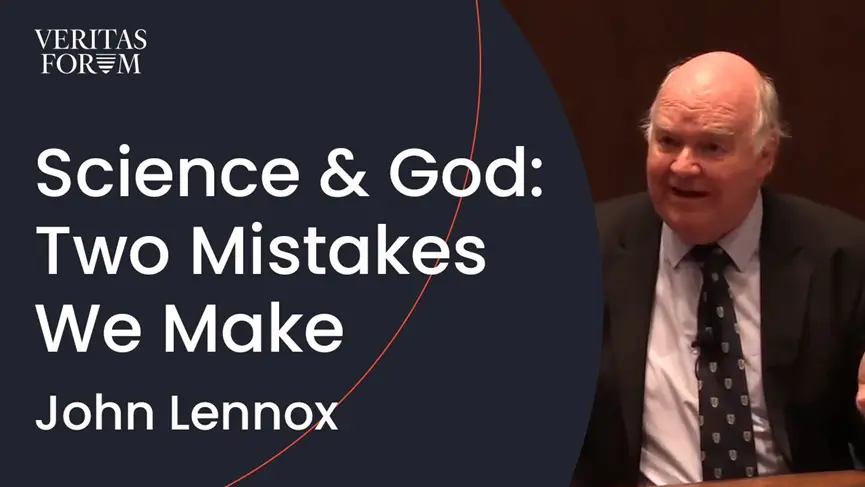
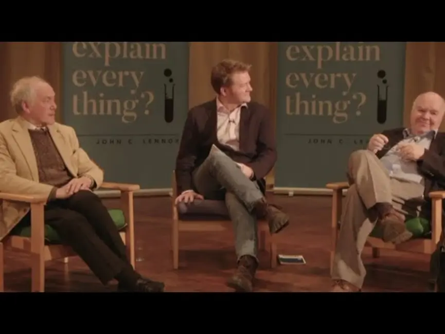
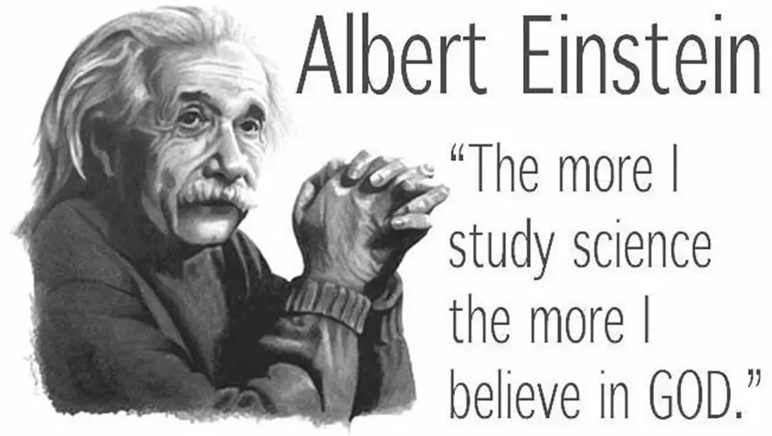
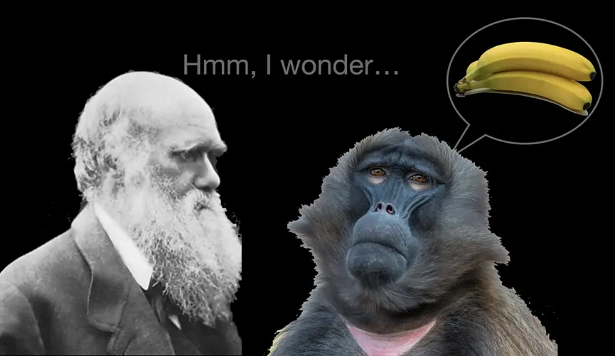
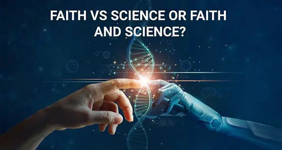
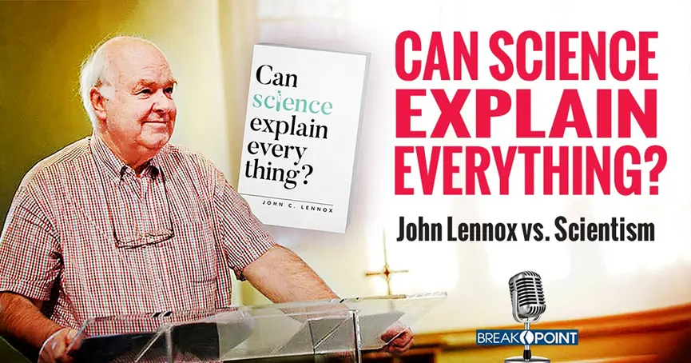

# 理性背后的信心：科学与无神论逃不掉的信仰问题 (中英对照)

文/ 约翰·伦诺克斯 （John Lennox）

I am often told that the trouble with believers in God is just that: they are believers. That is, they are people of faith. Science is far superior because it doesn’t require faith. It sounds great. The problem is, it could not be more wrong.
人们常说，信奉上帝的人的问题恰恰在于：他们是信徒。也就是说，他们是有信仰的人。科学远胜宗教，因为它不需要信心。这听起来很棒。问题是，这种说法错得简直离谱。

Let me tell you about an encounter I had with Peter Singer, a world-famous ethicist from Princeton University in the USA. He is an atheist, and I debated with him in his home city of Melbourne, Australia, on the question of the existence of God. In my opening remarks, I told the audience what I told you earlier: that I grew up in Northern Ireland and that my parents were Christians.
让我给你们讲讲我与彼得·辛格的一次会面，他是美国普林斯顿大学的世界著名伦理学家。他是一位无神论者。在他的家乡澳大利亚墨尔本，我曾与他就“上帝是否存在”的问题进行辩论。在我的开场白中，我告诉了观众我刚才告诉过你们的事情：我在北爱尔兰长大，我的父母是基督徒。

Singer’s reaction was to say that this was an example of one of his objections to religion—that people tend to inherit the faith in which they were brought up. For him, religion is simply a matter of heredity and environment, not a matter of truth. I said,
辛格的回应是，他说这是他反对宗教的一个例子——人们倾向于继承他们成长过程中所接受的信仰。对他来说，宗教只是遗传和环境的问题，而不是关乎真理的事情。我说：

“Peter, can I ask you—were your parents atheists?”
“彼得，我能问你个问题吗——你的父母是无神论者吗？”
“My mother was certainly an atheist. My father was maybe more agnostic,” he replied.
他回答道：“我的母亲肯定是无神论者。我的父亲可能更像是不可知论者。”
“So you’re perpetuating the faith of your parents too, like I am,” I said.
“那么你也延续了你父母的信仰，不是吗？”我说。
“It’s not faith, in my view,” he said.
“在我看来，这不是信仰。”他说。
“Of course it’s a faith—don’t you believe it?” I replied.
“当然是信仰——你难道不信吗？”我回答。
There was much laughter.  大家都笑了。
Not only that but, as I discovered later, cyberspace lit up with the question: doesn’t Peter Singer, a famous philosopher, realise that his atheism is a belief system? Has he never heard of people, like the cosmologist Allan Sandage, who became convinced by the evidence of the existence of God and converted to Christianity later in life?
不仅如此，我后来发现，网络上热烈讨论着一个问题：彼得·辛格，作为一位著名哲学家，难道没有意识到他的无神论是一种信仰体系吗？难道他从未听说过像宇宙学家艾伦·桑德奇那样的人，在晚年被上帝存在的证据所说服，并归信基督吗？

### What is faith?什么是信仰？

Many leading atheists share Singer’s confusion about faith and, as a result, make equally absurd statements. “Atheists do not have faith,”[note]The God Delusion, p 51.[/note] says Richard Dawkins, and yet his bookThe God Delusion is all about what he believes—his atheist philosophy of naturalism in which he has great faith. Dawkins, like Singer, thinks that faith is a religious concept that means believing where you know there is no evidence.

许多知名无神论者与辛格一样，对信仰存在误解，因此做出了同样荒谬的言论。理查德·道金斯在《上帝的错觉》第 51 页中说：“无神论者没有信仰”，但他的 《上帝的错觉》 一书却全是在讲他的信仰——他坚信的自然主义的无神论哲学。道金斯和辛格一样，认为信心是一个宗教概念，即在明知没有证据的情况下去相信。

They are quite wrong. Faith is an everyday concept, and they give the game away by frequently using it as such.

其实，他们完全错了。信心是一个日常概念，他们经常这样使用‘信心’一词，反而暴露了他们自身的矛盾。

According to the Oxford English Dictionary, the word comes from the Latin fides, which means loyalty or trust. And, if we have any sense, we don’t normally trust facts or people without evidence. After all, making well-motivated, evidence-based decisions is just how faith is normally exercised—think of how you get your bank manager to trust you or the basis for your decision to get on board a bus or an aircraft.
根据《牛津英语词典》，信心一词源于拉丁语 fides ，意为忠诚或信任。如果我们稍微有点常识，就知道我们通常不会在没有证据的情况下相信某些事实或人。毕竟，做出有理有据的、基于证据的决定，正是信心的正常体现——比如你如何让银行经理信任你，或者你决定坐上一班公交车或飞机的依据。

Believing where there is no evidence is what is usually called blind faith; and no doubt in all religions you will find adherents who believe blindly. Blind faith can be very dangerous—witness 9/11. I cannot speak for other religions, but the faith expected on the part of Christians is certainly not blind. I would have no interest in it otherwise.
没有证据的信心通常被称为盲信；毫无疑问，在所有宗教中，你都会发现一些信徒存在盲信的例子。盲信可能非常危险——9/11事件就是活生生的例子。我不能代表其他宗教发言，但基督徒所期望的信仰肯定不是盲目的。否则我不会接受基督教。

The Gospel-writer John says: “Now Jesus did many other signs in the presence of the disciples, which are not written in this book; but these are written so that you may believe that Jesus is the Christ, the Son of God, and that by believing you may have life in his name.” John, chapter 20, verses 30-31
福音书作者约翰说：“耶稣在门徒面前另外行了许多神迹，没有记在这书上。但记这些事，要叫你们信耶稣是基督，是神的儿子，并且叫你们信了他，就可以因他的名得生命。” （约翰福音20章 30-31节）

John is telling us that his account of the life of Jesus contains the eyewitness record of evidence on which faith in Christ can be based. Indeed, a strong case can be made that much of the material in the Gospels is based on eyewitness testimony.[note]See R. Bauckham, Jesus and the Eyewitnesses (Eerdmans, 2017)[/note]
约翰告诉我们，他对耶稣生平的记述中包含着亲眼所见的目击证据的记载。这些记载可以作为信靠耶稣基督的依据。事实上，有很强的证据表明，福音书中的大部分内容都是基于目击者的证词。[注]参见 R. Bauckham，《耶稣与目击者》（Eerdmans，2017 年）[/注]

### Do atheists have faith?无神论者有信仰吗？

This confusion about the nature of faith leads many people to another serious error: thinking that neither atheism nor science involves faith. Yet, the irony is that atheism is a belief system and science cannot do without faith.
这个对信心本质的误解，导致许多人犯下另一个严重错误：认为无神论和科学都不涉及信心。然而讽刺的是，无神论是一种信仰体系，科学也同样建立在某种信心之上。

Physicist Paul Davies says that the right scientific attitude is essentially theological: “Science can proceed only if the scientist adopts an essentially theological worldview”. He points out that “even the most atheistic scientist accepts as an act of faith [emphasis mine] … a law-like order in nature that is at least in part comprehensible to us”.[note] Templeton Prize Address, 1995 [/note]
物理学家保罗·戴维斯说，正确的科学态度在本质上是神学性的：“科学只能在科学家采取某种带有神学本质的世界观时方可进行”。他指出，“即便是最坚定的无神论科学家，也会以类似信仰的方式去接受这一前提：自然界存在某种法则性秩序，且至少有一部分是可为人理解的。”[注] 邓普顿奖演讲，1995 年[/注]

Albert Einstein famously said: “… science can only be created by those who are thoroughly imbued with the aspiration towards truth and understanding. This source of feeling, however, springs from the sphere of religion. To this there also belongs the faith in the possibility that the regulations valid for the world of existence are rational, that is, comprehensible to reason. I cannot conceive a genuine man of science without that profound faith [emphasis mine]. The situation may be expressed by an image: science without religion is lame, religion without science is blind.” [note]www.nature.com/articles/146605a0.pdf (accessed 23 October 2018).[/note]

> 爱因斯坦有句名言：“……科学只能由那些对真理和理解的满怀渴望的人创造。然而，这种情感的源泉来自于宗教的领域。同属此类的还有这样一种信念：即相信那些对实存世界有效的法则都是理性的，也就是说，有被理性所理解的可能。我无法想象，一个真正的科学家会缺乏这种深刻的信念。可以用一个比喻来描绘：没有宗教的科学是瘸腿的，没有科学的宗教是盲目的。” [注]www.nature.com/articles/146605a0.pdf [/注]

Einstein evidently did not suffer from Dawkins’ delusion that all faith is blind faith. Einstein speaks of the “profound faith” of the scientist in the rational intelligibility of the universe. He could not imagine a scientist without it. For instance, scientists believe (= have faith) that electrons exist and that Einstein’s theory of relativity holds because both are supported by evidence based on observation and experimentation.
显然，爱因斯坦并没有陷入道金斯所认为的“所有信心都是盲信”的错觉中。爱因斯坦谈到了科学家对宇宙的可理解性的“深刻信念”。他无法想象哪个科学家会没有这种信仰。例如，科学家们相信电子存在，相信爱因斯坦的相对论成立，因为这两者都得到了基于观察和实验的证据支持。

My lecturer in quantum mechanics at Cambridge, Professor Sir John Polkinghorne, wrote, “Science does not explain the mathematical intelligibility of the physical world, for it is part of science’s founding faith [notice his explicit use of the word] that this is so…”[note]J. Polkinghorne, Reason and Reality (SPCK, 1991), p 76.[/note] for the simple reason that you cannot begin to do physics without believing in that intelligibility.
我在剑桥大学的量子力学讲师约翰·波金霍恩教授写道：“科学并不会去解释物理世界在数学上的可理解性，因为这是科学的基本信念之一……”[注意，他毫不避讳地使用了‘信念’一词] [注]J. Polkinghorne，《理性与现实》（SPCK，1991年），第76页。原因很简单，如果你不相信这种可理解性，你就无法开始做物理研究。

On what evidence, therefore, do scientists base their faith in the rational intelligibility of the universe, which allows them to do science? The first thing to notice is that human reason did not create the universe. This point is so obvious that at first it might seem trivial; but it is, in fact, of fundamental importance when we come to assess the validity of our cognitive faculties. Not only did we not create the universe, but we did not create our own powers of reason either. We can develop our rational faculties by use; but we did not originate them. How can it be, then, that what goes on in our tiny heads can give us anything near a true account of reality? How can it be that a mathematical equation thought up in the mind of a mathematician can correspond to the workings of the universe?
那么，科学家基于什么证据相信宇宙的可理解性，从而使他们能够进行科学研究呢？首先要注意的是，人类理性并没有创造宇宙。这一点看起来可能显得微不足道。但事实上，当我们评估我们的认知能力的有效性时，这一点至关重要。我们不仅没有创造宇宙，也没有创造我们自己的理性能力。我们可以在使用中发展我们的理性天赋；但我们并没有创造它们。那么，我们小小的脑袋里发生的事情怎么可能给我们提供接近真相的现实描述呢？数学家头脑中想出的数学方程式怎么可能与宇宙的运作相吻合呢？

It was this very question that led Einstein to say, “The most incomprehensible thing about the world is that it is comprehensible”. Similarly the Nobel Prize-winning physicist Eugene Wigner once wrote a famous paper entitled, “The unreasonable effectiveness of mathematics in the natural sciences”.[note]Communications in Pure and Applied Mathematics, vol. 13, No. 1, February 1960 (John Wiley & Sons).[/note] But it is only unreasonable from an atheistic perspective. From the biblical point of view, it resonates perfectly with the statements: “In the beginning was the Word … and the Word was God … All things came to be through him” (John 1 v 1, 3).
正是这个问题促使爱因斯坦说：“宇宙最不可理解之处就是它是可以理解的。” 同样，诺贝尔物理学奖得主尤金·维格纳也曾写过一篇著名的论文，题为“数学在自然科学中不合理的有效性”。[注]《纯粹与应用数学通讯》，第 13 卷，第 1 期，1960 年 2 月（John Wiley & Sons）。[/注]但它只是在无神论的视角下才显得不合理。从圣经的视角来看，它与以下话语完美相契：“太初有道…道就是神……万物是藉着他造的”（约翰福音1章1、3节）。

Sometimes, when in conversation with my fellow scientists, I ask them “What do you do science with?”
当我与我的科学家同事们交谈时，我有时会问他们：“您用什么做科学？”
“My mind,” say some, and others, who hold the view that the mind is the brain, say, “My brain”.
一些人说“我的理智”，而另一些人则认为理智就是大脑，他们说“我的大脑”。
“Tell me about your brain? How does it come to exist?”
“跟我讲讲你的大脑吧？它是如何起源的？”
“By means of natural, mindless, unguided processes.”
“通过自然的、无心智思想的、无引导的过程。”
“Why, then, do you trust it?” I ask. “If you thought that your computer was the end product of mindless unguided processes, would you trust it?”
“那么，你为什么信任你的大脑呢？”我问道。“如果你认为你的计算机是无心智的、无引导过程的最终产物，你会相信它吗？”
“Not in a million years,” comes the reply.
“就算过一百万年，也不会。”他回答道。
“You clearly have a problem then.”
“那很明显你在这上面就遇到了问题。”

After a pregnant pause they sometimes ask me where I got this argument—they find the answer rather surprising: Charles Darwin. He wrote: “…with me the horrid doubt always arises whether the convictions of man’s mind, which has been developed from the mind of the lower animals, are of any value or at all trustworthy.”[note]Letter to William Graham, 3rd July 1881. The University of Cambridge Darwin Correspondence project.[/note]
他们有时会深思沉默许久后问我的这个论点是从哪儿来的——他们对答案颇感惊讶：查尔斯·达尔文。达尔文写道：“……我总是产生可怕的怀疑，人类思想中的信念，既然是从低等动物的心智发展而来，是否具有任何价值或可信度。” [注]《致威廉·格雷厄姆的信》，1881年7月3日，剑桥大学达尔文通信项目。[/注]

Taking the obvious logic of this statement further, Physicist John Polkinghorne says that if you reduce mental events to physics and chemistry you destroy meaning. How? 
顺着这句话的明显逻辑，物理学家约翰·波金霍恩 (John Polkinghorne) 指出：如果你将心智活动还原为物理和化学活动，你就摧毁了意义。为什么呢？

For thought is replaced by electrochemical neural events. Two such events cannot confront each other in rational discourse. They are neither right nor wrong—they simply happen. The world of rational discourse disappears into the absurd chatter of firing synapses. Quite frankly that can’t be right and none of us believe it to be so.[note]One World: The Interaction of Science and Theology (SPCK, 1986), p 92.[/note] Polkinghorne is a Christian, but some well-known atheists see the problem as well.
因为思想被取代为电化学神经活动。这样两个电化学事件无法在理性的交流中相遇。它们既不对也不错——它们只是发生了。一个理性彼此交谈的世界就此淹没在神经元突触活跃而无意义的喧哗中。坦率地说，这显然不对，我们中也没有人相信那是真的。[注]《一个世界：科学与神学的互动》（SPCK，1986 年），第 92 页。[/注] 波金霍恩本人是一名基督徒，但一些著名的无神论者也同样看到了这一问题。

John Gray writes: “Modern humanism is the faith that through science humankind can know the truth—and so be free. But if Darwin’s theory of natural selection is true this is impossible. The human mind serves evolutionary success, not truth”.[note]Straw Dogs (Granta Books, 2002), p 26.[/note]
约翰·格雷写道：“现代人文主义是这样一种信仰——认为人类可以凭借科学来认识真理，从而获得自由。但如果达尔文的自然选择理论成立，这种可能性就将不复存在。人类的心智服务于进化的胜出，而非真理。” [注]《稻草狗》（格兰塔出版社，2002 年），第 26 页。[/注]

Another leading philosopher, Thomas Nagel, thinks in the same way. He has written a book, Mind and Cosmos, with the provocative subtitle Why the Neo-Darwinian View of the World is Almost Certainly False. Nagel is a strong atheist who says with some honesty, “I don’t want there to be a God”. And yet he writes: “But if the mental is not itself merely physical, it cannot be fully explained by physical science. Evolutionary naturalism implies that we shouldn’t take any of our convictions seriously, including the scientific world picture on which evolutionary naturalism itself depends.”[note]Thomas Nagel, Mind and Cosmos (OUP, 2012), p 14 [/note]
另一位顶尖哲学家托马斯·内格尔 (Thomas Nagel) 也有同样的想法。他写了一本书， 名为《心灵与宇宙》 ，副标题颇为挑衅——“为什么新达尔文主义的世界观几乎肯定是错误的”。内格尔是一位坚定的无神论者，他曾坦言：“我并不希望上帝存在”。但他又写道：“但如果心智本身不仅仅是物质的，那么它就无法用纯粹的自然科学完全解释。进化自然主义暗示我们不应该把任何信念当回事，包括进化自然主义本身所依赖的符合科学的世界图景。”[note]托马斯·内格尔，《心灵与宇宙》（牛津大学出版社，2012 年），第 14 页 [/note]

That is, naturalism, and therefore atheism, undermines the foundations of the very rationality that is needed to construct or understand or believe in any kind of argument whatsoever, let alone a scientific one. Atheism is beginning to sound like a great self-contradictory delusion —“a persistent false belief held in the face of strong contradictory evidence”.
换言之，自然主义，也就是无神论，实际上破坏了那种用来构建、理解或相信任何论证（更不用说科学论证）所必需的理性基础。无神论开始听起来像是一种极端自相矛盾的妄想——“一种在强烈矛盾的证据面前仍然坚持的错误信念”。

Of course, I reject atheism because I believe Christianity to be true. But I also reject it because I am a scientist. How could I be impressed with a worldview that undermines the very rationality we need to do science? Science and God mix very well. It is science and atheism that do not mix.
当然，我拒绝无神论，不仅因为我相信基督教是真理，也因为我是一名科学家。我怎能对一种破坏了进行科学研究所需理性的世界观产生好感呢？科学与上帝可以很好地兼容，而科学与无神论才是水火不容。

### Simplicity and complexity 简单与复杂

Another way of looking at this is to think once more about explanation. We are often taught in science that a valid explanation seeks to explain complex things in terms of simpler things. We call such explanation “reductionist” and it has been successful in many areas. One example is the fact that water, a complex molecule, is made up of the simpler elements hydrogen and oxygen.
换一种角度来思考，我们不妨重新审视“解释”的含义。我们常被教导，在科学里，一个有效的解释会试图用更简单的事物来解释复杂的事物。我们称这种解释为“还原论”，它在许多领域都很成功。举例来说，水这一复杂的分子，由更简单的氢、氧元素构成。

However, reductionism doesn’t work everywhere. In fact, there is one place where it does not work at all. Any full explanation of the printed words on a menu, say, must involve something much more complex than the paper and ink that comprise the menu. It must involve the staggering complexity of the mind of the person who designed the menu. We understand that explanation very well. Someone designed the menu, however automated the processes are that led to the making of the paper and ink and carrying out the printing.
然而，还原论并非在所有地方适用。事实上，有一个领域它根本无法奏效。比如，你要完整解释菜单上印刷的文字，就不仅仅涉及构成菜单的纸张和墨水，更需要牵涉到这份菜单的设计者惊人的复杂思维。我们非常理解这种解释。无论制造纸张墨水以及印刷的过程多么自动化，都必须有人设计出这份菜单。

The point is that when we see anything that involves language-like information, we postulate the involvement of a mind. We now understand that DNA is an information-bearing macromolecule. The human genome is written in a chemical alphabet consisting of just four letters; it is over 3 billion letters long and carries the genetic code. It is, in that sense, the longest “word” ever discovered. If a printed, meaningful menu cannot be generated by mindless natural processes but needs the input of a mind, what are we to say about the human genome? Does it not much more powerfully point to an origin in a mind—the mind of God?

关键在于，当我们看到任何涉及类似语言信息的东西时，我们都会假设其中有“心智”的参与。如今我们知道，DNA 是一种承载信息的大分子。人类基因组是用四个字母构成的化学字母表编写的；它由超过 30 亿个字母组成，并携带着遗传密码。从这个意义上说，它是迄今为止发现的最长的“单词”。如果一份承载有意义信息的菜单无法通过无意识的自然过程生成，而必须倚赖某种心智的介入，那么我们又该如何看待人类基因组呢？它不是更有力地指向其起源于某种心智——即上帝的心智吗？

Atheist philosophy starts with matter/energy (or, these days, with “nothing”) and claims that natural processes and nature’s laws, wherever they came from, produced from nothing all that there is—the cosmos, the biosphere and the human mind. I find this claim stretches my rationality to breaking point, particularly when it is compared with the biblical view that:
无神论哲学从物质/能量（或如今的“虚无”）出发，声称是自然过程和自然法则，无论它们从何而来，从虚无中产生出一切——宇宙、生物圈和人类的心灵。我觉得这一主张几乎将理性推至崩溃的边缘，尤其当它与圣经观点进行对比时：
> In the beginning was the Word … the Word was God … All things were made through him… John 1 v 1,3
> “太初有道……道就是神……万物是藉着他造的……”（约翰福音 1:1,3）

This Christian worldview resonates first with the fact that we can formulate laws of nature and use the language of mathematics to describe them. Secondly, it sits well with the discovery of the genetic information encoded in DNA. Science has revealed that we live in a word-based universe, and we have gained that knowledge by reasoning.
此基督教的世界观首先与这样的事实相印证：我们可以制定自然法则并使用数学语言来描述它们。其次，它与 DNA 中所蕴含遗传信息的发现完美契合。科学已经揭示，我们生活在一个以“文字”为基础的宇宙中，而我们正是通过理性推理获得了这一知识。

C.S. Lewis argues this point saying that “unless human reasoning is valid no science can be true.” If ultimate reality is not material, not to take this into account in our context is to neglect the most important fact of all. Yet the supernatural dimension has not only been forgotten, it has been ruled out of court by many. Lewis observes: “The Naturalists have been engaged in thinking about Nature. They have not attended to the fact that they were thinking. The moment one attends to this it is obvious that one’s own thinking cannot be merely a natural event, and therefore something other than Nature exists.”[note]C.S. Lewis, Miracles (Touchstone, 1996), p 23.[/note]
C.S. 路易斯就此提出观点，他认为：“除非人类的理性推理能力有效，否则任何科学都不可能是真理。” 如果终极实在不是物质性的，那么在我们的讨论中忽视这一点，便是忽略了最重要的事实。可惜的是，超自然这一维度不仅被人遗忘，甚至被许多人完全排除在外。路易斯观察到：“自然主义者一直在思考自然，却从未注意到他们正在思考本身。一旦注意到这一点，就会立马意识到人的思考本身绝非仅仅是自然事件，且将因此意识到必有自然之外的存在。”
【注】C.S. 路易斯，《神迹》，Touchstone，1996，第23页【注】

Not only does science fail to rule out the supernatural—the very doing of science or any other rational activity rules it in. The Bible gives us a reason for trusting reason. Atheism does not. This is the exact opposite of what many people think.
科学不仅无法排除超自然的存在——实际上，科学或任何其他理性活动反而需要纳入超自然的存在（方能自洽）。《圣经》为我们提供了信任理性的理性基础，而无神论却没有。这与许多人所想的截然相反。

----------------------------------

本文摘自约翰·伦诺克斯 (John Lennox) 所著《科学能解释一切吗？》(Can Sciene Explain Everything?)

张云轩译，熊圣恩校对

约翰·伦诺克斯（John Lennox）是牛津大学的数学荣休教授，曾在牛津大学、哈佛大学、耶鲁大学等多所知名学府担任讲座嘉宾。

他不仅是一位在数学、科学哲学及宗教思想方面广受尊敬的学者，也是一位活跃的公众演说家，以深入浅出的方式探讨科技进步、人类信仰与世界观之间的关系。他著有多本探讨科学与宗教对话的畅销书，并曾在国际舞台上与如理查德·道金斯、克里斯托弗·希钦斯等著名无神论者就科学与信仰问题展开辩论。他的思想常被认为能够引发思考，挑战读者对科学、人生意义与信念的既有理解。

