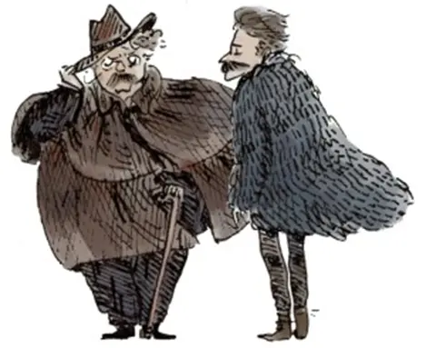

# 上帝已死：切斯特顿 vs. 尼采

按
在中国，尼采的思想自20世纪初传入便掀起了持久的回响。1904年，王国维首倡“破旧立新”，将尼采“破坏旧文化而创造新文化”的核心理念介绍给世人，拉开了中国知识界对尼采热情探讨的序幕。此后，鲁迅、陈独秀等新文化运动的先锋人物竞相援引与传播尼采的“超人”思想和价值重估论。在当代，这位德国哲学家的著作依旧在各大书店中占据显著位置，尼采精神更是广泛渗透于哲学、文学、艺术等多个领域，成为学术研究与大众阅读的常客。与此同时，康德、黑格尔、叔本华、马克思等德国哲学家同样在中国拥有庞大读者群。

然而，与广为人知的尼采形成鲜明对照的，是一位同样深刻洞见现代思想危机的英伦知识分子：G.K.切斯特顿。他对尼采哲学所带来的虚无主义发出了警诫，却鲜有人在中国语境中认真聆听过他的声音。

2011年，切斯特顿协会（Society of Gilbert Keith Chesterton）推出电视节目《上帝已死：切斯特顿 vs. 尼采》，构想了一场跨越时空的思想对话，将这两位有影响力的思想家置于正面交锋之中。

本文整理该节目的文字内容，揭示切斯特顿如何以常识之笔，逐步拆解尼采的“疯狂逻辑”，并发出他对现代文明深沉而警醒的呼声。

---

去掉了超自然之物，剩下的就是非自然之物……

**尼采**：
我是第一个反道德论者。有一天，我的名字将与一些非凡的事物铭记在一起——一场地球上前所未有的危机，最深层次的良知冲突；一个与迄今为止人们所信、所要求、所尊为圣的一切都背离的决定。

我不是人，我是炸药。我的真理是可怕的，因为到目前为止还没有人称谎言为真理。我是第一个发现真理的人。罪的概念是作为一种酷刑而发明的；自由意志概念的发明是为了让本能困惑；善的概念被发明是为了让人站在弱者一边，站在失败一边，站在苦难本身一边。所有这些东西都应该灭亡。

我必须让人类面对有史以来最艰巨的任务。宗教是下层庸众的东西。只有少数了解我的人才明白，只有我们……是未来尚未到来时就提前出生的时代早产儿。我们是新的，无名的，不言而喻的，更强大的，更大胆的。我们是超越现代人的最高成就——超越善恶。我们已消灭了道德，我们是超人。

上帝已死，我们杀死了他。

**主持人（戴尔·阿尔奎斯特）：**
自从这些朗朗上口的短句从尼采的口里说出，所谓的知识分子们已将其全盘接受装入肚内。结果就是，这个疯子不幸成为了现代世界最有影响力的哲学家。其实，尼采自己全盘接受了另一套哲学，正是这套哲学提供了他主要的思想——只有最强者才能生存，弱者则是可牺牲的；无止境的进步；人类不仅已经进化到了现在的地步，而且现在必须超越之。

这些原则都是尼采从达尔文主义中汲取的。尼采相信：人类正在进化成一种超越人类的更高生命形式。他声称我们已经走在超越曾经信奉宗教的“旧”人类的路上——我们不再需要宗教。上帝已死，上帝已绝，神的功能之一是提供道德上的统一。因着上帝已死，道德也随之灭绝了。我们已经超越了善恶。

众多的哲学教授和他们的学生被这些思想所诱惑，他们未能像其它人文领域的同行所做的那样去解剖尼采。没有人发现尼采的根本缺陷，唯有一个人做到了：G.K.切斯特顿。

**切斯特顿**：
尼采以其鲜明的想象力，想象着用卓越的怪物取代人类，并自以为在反抗、在颠覆基督教传统。但他甚至不知道他反抗的是什么——实际上是在反抗人类，或者说，他的哲学植根于对人的绝望。

为使自己得着慰藉，他将含混不清的热情投入到一种理念：超人哲学。但是，这种对更卓越生物的期盼究竟意味着什么？意味着把这种现行被称作“人”的动物，当成一种灭绝的动物——他是一具在街上行走的化石，是宇宙的某种阑尾，多余的器官。人类在进化中幸存下来，只是为了证明自己没有生存价值。人是宇宙的疾病，是众星的阑尾炎。他必须被改进、简化，让步于新一代无名的超人类。

但是，这个简化的超人到底长什么样？诚然，一个没有鼻子的人不是完整的人，但只要对超人略知一二，你就会同意没鼻子可能对超人更好——鼻子可能是细菌的温床；擤鼻涕声可能会惊扰到那位未来强人的脆弱神经器官。他可是要成为我们众人的主人呢。

这位现代哲学家（尼采）并非企图除掉人的烦恼，而是企图除掉人，因为人正是这位哲学家的烦恼。

关于尼采最被忽视的一点，切斯特顿并没有忽略：尼采是贵族统治论者。这就部分解释了他为什么蔑视普通人。贵族统治不是一个系统，而是一个意外——当一小群人有太多的钱时，就会发生这种情况，让他们没法老老实实工作。切斯特顿说：“贵族统治是富人对穷人的叛乱，这些精英群体错误地以为，他们的财富和权力自动伴随着好想法。”

尼采仰慕强者，鄙视弱者。但具讽刺意味的是，他并不是自己所仰慕的那种人——他是软弱之人。切斯特顿说，他是一个体弱多病、挑剔、完全无用的无政府主义者。所有著作无不充斥着他肉体生命的痛苦和热症，然而，他对弱者有一种奇怪的仇恨，延伸到了对全人类的仇恨。尼采说，我们需要超人。
 
**尼采**：人必须被超越。
**切斯特顿**：在某种意义上，这句话相当符合基督教的观念，但如果你没有固定不变的关于善的标准，你怎么知道人何时已被超越？

**尼采**：我所要做的，无人做过；我要反驳的，无人反驳过；我要重估、颠覆一切价值；我要把每个人从道德的束缚中解放出来。
**切斯特顿**：对未经证实、未经考验之事物的爱，实际上等同于对什么都不爱。

**尼采**：虚无主义呼之欲出，虚无主义的胜利是必然的。最高价值已经失去了价值，道德已经失去了目的。过去的事情必须被打破。
**切斯特顿**：虚无主义者，顾名思义，找不到可去反抗的东西。

**尼采**：关于生命，历代最智慧的人都做出了同样的判断：它毫无用处。
**切斯特顿**：每个高度文明的衰落都是因为忘记了显而易见的事情。我们这一代生活在一个肮脏悲观的时期，亵渎地低估了生命之美，却怯懦地高估了它的危险性。

**尼采**：没有永恒不朽，你的人生就会难以忍受。但为什么你的人生不应该难以忍受呢？你说一个好理由可以合理化任何战争，我说一场好战争可以合理化任何理由。一个人必须内心混乱，才能孕育出一颗舞动的星。
**切斯特顿**：尼采是现代世界最杰出的修辞家之一，他的语言充满诗意。他有一种非凡的能力：能说出一些极不合理的话来暂时掌控人们的理智。

**主持人**：
尼采的语言充满魅惑，而且“语不惊人死不休”；然而，他的口吻总带着轻蔑。他以高傲的讥讽，无休止地嘲笑人类。他可以冷笑，却无法开怀大笑。他的追随者也是如此。切斯特顿观察到，没有人遇见过一个快乐的尼采主义者。

奇怪的是，尼采宣扬一种强硬之道。为什么说奇怪呢？切斯特顿说，宣扬任何东西就是把它送给别人，这是利他主义的行为。尼采为何要在意“强者将凌驾于弱者”、为何要在意一切价值必须得重估？反正这事不可避免会发生，早点或晚点发生又有何区别？如果一切都是自然演进的一部分，人们知道这有什么好处？也许困扰着尼采的是，他未能将自己的信息传播给更多人；也许是“上帝已死”；也许困扰他的，是他最终精神失常——他在疯人院度过了生命最后的11年，1900年去世，而G.K.切斯特顿则于同年开始了作家生涯。

有人说尼采因得梅毒而发疯；也许吧，但那些传记作家在叙述时遗漏了他如何得梅毒的事实：他是故意让自己染病的——他故意去找了一个他知道有这种病的妓女。一个人去嫖妓，就已表明他某种程度上丧失了清醒的思维。但怀着像尼采那样的动机去嫖妓，则绝非心智正常之人所为。

**切斯特顿**：
尼采试图以奇怪而可悲的大胆践行他的原则。他拥抱不道德，就像拥抱一种严酷的信仰。一个基督徒以战兢的热忱追求纯洁和忍耐，而尼采则用同样的热忱投身于情欲和残忍。他拼搏，正如修道士与兽性的异象和诱惑争战；然而，他拼搏的目的是为了反抗荣誉、正义和怜悯心这些古老的必需品。

**主持人**：
有人说尼采精神崩溃的诱因是他曾看到有人无情地鞭打一匹马；这也许是真的，但若如此，也证明尼采并不相信自己的哲学——为何突然同情一匹马？他所宣扬的“强硬”精神到哪里去了？切斯特顿另有解释：正是他的哲学使他发疯，因为任何将这种思想推演到逻辑结论的人，都会落得尼采的下场——被送到疯人院。

切斯特顿说，诗人要求的，不过是把头探进天堂；逻辑学家寻求的，是把天堂放进脑子里。因此，逻辑学家的脑袋裂开了。
切斯特顿将疯狂定义为“使用心智活动以达到心智上的无助”，这正是尼采最终达成的——心智上的无助。

切斯特顿说，尼采的所有问题在于他持有一种违背自然、不合常情的哲学；任何一个正常人都会认识到它是违背自然的。

**切斯特顿**：
假设在一辆公共汽车上，四个受过教育的人在收听某位新德国哲学家的讲座，谈“超人哲学”和“主人道德”：
1.	一人会说这个哲学家很邪恶；
2.	一人会说他不合逻辑；
3.	一人说他夸大其词；
4.	最后一人说他不切实际。

但公交车司机更有智慧，他只轻描淡写地说：“那位德国先生已经疯了。”当然，这才是他心灵的根本真相：他或许有一些值得借鉴的思考，但他没有稳健、全面地看到生命的全部；他发动一场徒劳的战争，让美德去对抗美德，失去了人类本质中许多相反品质的平衡，而这恰恰是“人之为人”的全部意义。

一位普通公交车司机凭直觉对尼采的评价，省去了无数哲学家复杂赘述：尼采的哲学思想缺乏适应普遍人类经验或共同理解的特征。借一句流行语：“他思维不正常，有些缺心儿。”

**主持人**：
尼采的思想在任何正常时代都会遭到谴责，但更可能的是在有机会遭谴责以前，就被人们抛弃了——任何正常人都不会把他的思想当回事儿，就像那司机一样。

切斯特顿说，几乎所有德国哲学都与常识相悖：康德、黑格尔、叔本华、尼采、马克思无不如此。但这些所谓“独创”思想，并不新鲜。

**切斯特顿**：
众所周知，尼采本人和追随者都认为他所宣扬的学说空前绝后——例如他认为普通人的利他主义道德是奴隶阶级发明，目的是防止高级人种统治他们。现代人无论是否同意，总以为这是前所未闻的新观念。人们冷静而执着地以为，过去诸如莎士比亚这样的伟大作家不信这套（尼采哲学），是因为他们从来没有想到过，是因为这种哲学从未在他们的脑海中出现过。

然而，翻到莎士比亚《理查三世》最后一幕，你不仅会发现尼采所说的一切皆被概括在两行之内，而且它正用尼采自己的话来表达：

> ‘良心’是挂在懦夫嘴边的一句话，当初撰造这词只是为了吓退强者。（《理查三世》第五幕，第三场）

你看，莎士比亚思量过尼采的“主人道德”。但沙翁掂量过它的价值后，就把它放在适当的地方——只配出现在一个半疯癫的驼子败北前的嘴里。

这种针对弱者的愤怒，只可能存在于那种有着病态的勇敢、却实在病了的人身上——诸如，理查三世、尼采等辈。单凭此例，便足以摧毁 “这些现代哲学家之所以是现代的，是因为古时的伟人未曾想过他们所想的”这一荒谬观念——古时的伟人确实想到过，只是不太重视。莎士比亚并非没有预见尼采的思想。他看见了，还看穿了它。

**主持人**：
尽管尼采和其哲学疯狂无比，但20世纪众多知名知识分子却把他的思想当回事儿。例如，尼采曾公开倡导优生学，主张“不受欢迎的人”应绝育，主张婚姻在医学监督下发生。用他自己的话说：“为了拯救人类，许多人必须被牺牲。”然而萧伯纳等人竟欣然接受这种思想，计划生育组织创始人玛格丽特·桑格也表示赞同，她还在《节育评论》期刊的封面登出“适者多生、不适者少生”的口号。

G.K.切斯特顿看到了所有危险，预言计划生育必将导致堕胎、杀婴和安乐死。他如先知般地预言，我们会开始杀害那些我们认为对他们自身是累赘的人，而紧接着只需一步之遥，我们就会开始杀害那些对我们是累赘的人。他观察并发出警告：有一个国家从上到下信奉了尼采主义——不出意外，这个国家就是曾孕育出所有疯狂德国哲学的地方——德国。切斯特顿似乎是当时唯一意识到正在发生什么的人。

切斯特顿在1934年评论道：“德国人所说的、我们所听到的，以及他们有意让我们听到的、他们对自己行为的阐述，都包含对残暴的特别强调——不是作为可驳回的指控，而是作为应被赞扬的卓越特质。德国民众可能欣赏这种特质；然而很肯定，纳粹领导人因具此特质而自我感觉良好。尼采关于价值重估的观念确实产生重大影响，有一点可以确定：我们将真正体验战争和分裂的含义，而且是前所未有的方式。”

切斯特顿说，世界将爆发一场新战争——这将是 历史上最糟糕、最可怕的战争，而且战火将从波兰边境开始燃烧。切斯特顿于1936年去世；在他去世后不久，他的预言便应验了。

尼采关于自己的预测也不幸成真：他确实成功制造出地球上前所未有的危机——纳粹不仅发动几乎摧毁欧洲的血腥战争，而且在倡导重估一切价值的狂热中，有组织地屠杀600万犹太人和500万波兰天主教徒。尽管切斯特顿预见到战争，说中了尼采与纳粹德国的联系及其可怕后果，知识界却完全忽略了他的思想，切斯特顿被遗忘了。

在二战结束后的几十年里，发生了什么？在发现集中营和毒气室至今的这段日子里，发生了什么？尼采的可怕思想发酵付诸实践后，发生了什么？他的思想比从前更受欢迎——数以百万计的学生在美国大学校园里接受尼采哲学教育；一批新知识分子教导价值重估，他们引述尼采，津津乐道 “上帝已死”，宣扬传统道德必须被抛弃或超越。他们如同尼采的传声筒，劝人超越善恶。

接下来的两三代人被灌输了尼采的疯狂思想，却被剥夺了机会，从未听说切斯特顿的常识之智。他们不晓得切斯特顿早已回应了尼采所有荒谬论点：“尼采提出要把我们提升到凌驾于野兽之上的地位，竟是通过废除唯一能让我们凌驾野兽之上的东西——罪感。”尼采想否认上帝，因为他想否认罪；甚至在今天，没有人愿谈神，因为没人愿谈罪，而罪正是我们与神隔绝的原因。

尼采认为自己非常大胆，因为他试图颠覆基督教文明，夸口说他用言辞做了无人曾做的事——他不是在宣布“上帝已死”，就是在宣称“上帝是魔鬼”。

**尼采**：
上帝在结束一天工作后化作一条蛇，躺在分别善恶树下休息。这样，他便从神的身份复原过来：魔鬼不过是上帝在第七天闲暇时的身份。

**主持人**：
切斯特顿也使用意象，其大胆程度与尼采相当，其方式却超出了尼采的想象。

**切斯特顿**：
在世上众多宗教中，唯有基督教认为，上帝若仅全能，便不是完全的上帝；唯有基督教认为，为了圣洁的缘故，上帝必须既是国王又曾做过叛乱分子；唯有基督教把勇气加于造物主的美德中，因为真正的勇气，必然意味着灵魂历经崩溃的极点却没有崩溃。

在这一点上，我触及了黑暗、可怕且极难讨论之事。若有不当或似乎不敬措辞，我提前道歉。我要触及的事，连最伟大的圣徒和思想家都害怕触及：在那惊人的关于基督受难的记载中，有一个明确的情感暗示——万物的创造者不仅以某种不可思议方式经历了极度痛苦，而且还经历了怀疑。在伊甸园里，撒旦试探人类；但在客西马尼园里，上帝试验上帝。

他以某种超人的方式经历了我们人类极度可怖的悲观——当大地震动，太阳从天上灭没，正是在十字架上的呼喊，呼告着“上帝被上帝离弃”。现在，让革命家们从万千信条中选一信条，从众神中选一神。他们找不到（除基督教以外的）另一位神曾亲历叛乱。哦不，事情已无法言说。就让不信神之人自己选择一位神吧——他们将发现，唯有一位神呼喊出他们心底的孤立无援；唯有一个宗教，它的神似曾一瞬间成了一名不信神者。

**主持人**：
尼采虽充满原创性和诗意的亵渎，却远不及切斯特顿大胆和美妙。切斯特顿接过德国哲学家抛出的挑战，借用他们的辞藻反击回去：让无神论者选择一位神吧，他们会发现，除了基督教之外，不存在任何宗教能同情他们的怀疑；除了把一切翻转过来的基督教，他们找不到任何其他宗教，其神竟自己成了叛贼。切斯特顿说：“如果没有上帝，就不会有反神论者。”

然而，无神论者偶尔得势，他们宣布“上帝已死”，尽管基督教远在他们之前就如此宣布——这就是基督教的教义：“上帝已死，为我们而死。”正如切斯特顿所指出的，自那时以来，基督教似乎已死过好几回：它被击败、被拆毁、被铲除，却又复活了，因为它有一位知道如何走出坟墓的上帝。

我是戴尔·阿尔奎斯特，欢迎再次收看我们的节目《常识的使徒》。请支持美国切斯特顿协会，帮助我们让常识更普及。

-----
翻译：张云轩 2023
再次校对：张云轩 2025
欢迎转发、转载

**切斯特顿（G. K. Chesterton）是谁？**
在推理小说爱好者中，他是《布朗神父》系列的作者；在思想界，他却远不止于此。他是20世纪初英国最具影响力的公共知识分子之一，集诗人、记者、剧作家、评论家、神学家与辩论家于一身，曾与萧伯纳、H.G.威尔斯等人并列为时代巨擘。即便是与他政见相左的萧伯纳，也不吝赞誉他为“天才”。奥登、卡夫卡、博尔赫斯、海明威等文学巨匠，亦对他推崇有加。作为基督徒的切斯特顿，则以其锋利的逻辑与幽默的文笔，捍卫正统信仰、批判现代主义，被誉为“常识的代言人”。他的作品《回到正统》与《永恒之人》，直接影响了C.S.路易斯的归信之路。路易斯曾说，是《永恒之人》让他第一次意识到基督教可能是真实的。

[《上帝已死：切斯特顿 vs.尼采》视频版]
!(https://www.bilibili.com/video/BV1fa4y1c7cF)

