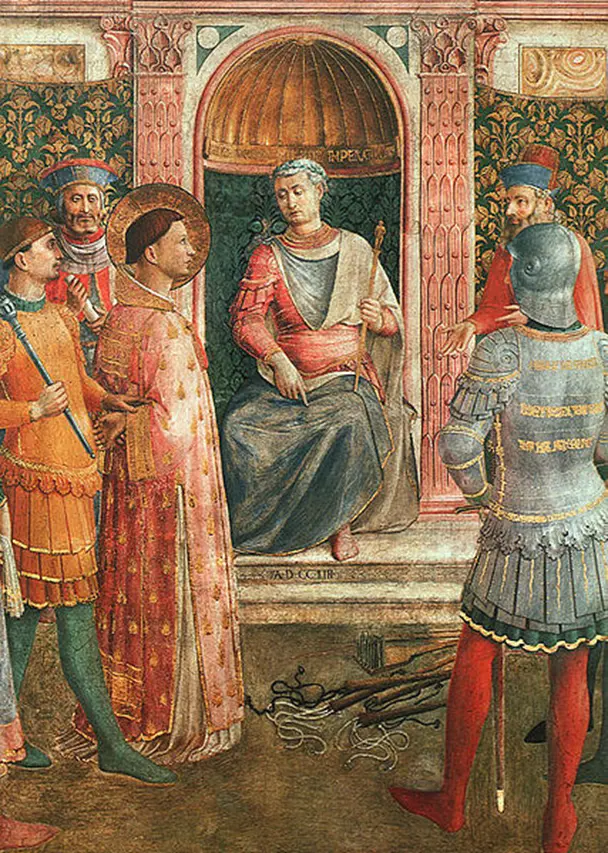

# 劳伦斯：一位死于讲笑话的殉道者

今天是8月10日。

在教会传统上，基督徒会在这天纪念劳伦斯这位生活在三世纪的殉道者。恰逢这个日子，就讲讲他的故事。

劳伦斯（Lawrence 或作 Laurence）是早期罗马教会的七位执事之一，负责管理教会的财产。当时的罗马皇帝瓦勒良（Valerian）认为教会有值得没收的宝贵东西，就命令劳伦斯交出 "教会的宝物"（treasures of the Church）。劳伦斯向罗马皇帝请求三天的期限，答应他三天后一定宣告教会的财产在那里。第三天到了，劳伦斯把那些因基督的爱而生命被改变的穷人、瘸子、盲人和受苦之人带到皇帝面前，并说：“在这些人身上，我将向您展示我所承诺的财富，她们就是教会的冠冕。”

Lawrence before Valerian, detail from a fresco by Bl. Fra Angelico, c. 1447–50, Pinacoteca Vaticana 《瓦勒里安面前的劳伦斯》，来自弗拉-安吉利科的壁画细节，约1447-50，梵蒂冈博物馆

我们可以想像，罗马皇帝是多么气急败坏，以为自己被愚弄了。在世人看来，这个劳伦斯向皇帝开了一个天大的玩笑。然而，这个教会史上最美丽的玩笑和行为艺术（之一）却讲述着一个不能再真的真相，因它回荡着一个基督自己讲过的比喻：

> “主阿，我们什么时候见你饿了给你吃，渴了给你喝？ 什么时候见你作客旅留你住，或是赤身露体给你穿？ 又什么时候见你病了，或是在监里，来看你呢？”

> “我实在告诉你们，这些事你们既作在我这弟兄中一个最小的身上，就是作在我身上了。"

> (马太福音 25:34-40)

基督的面容映在他们脸上，基督的灵以他们为居所，基督乐意把自己与他们认同。宇宙中有什么金银财宝比主所贵重的他们更贵重呢？

主后258年8月10日，劳伦斯殉道。相传一个罗马官长准备了一个巨大的烤架，下面铺满了火热的煤炭，将劳伦斯手脚固定活活烤死。在经过一段时间的折磨后，劳伦斯讲了他最后一个笑话：“Assum est. Versa et manduca." 翻译过来就是“我这面已经烤好了，现在把我转过去，烤另一面。”

参考：

[https://wellsofgrace.com/books/classic/martyr-ch/index.htm](https://wellsofgrace.com/books/classic/martyr-ch/index.htm)  福克斯，《殉道史》

https://en.wikipedia.org/wiki/Saint\_Lawrence

