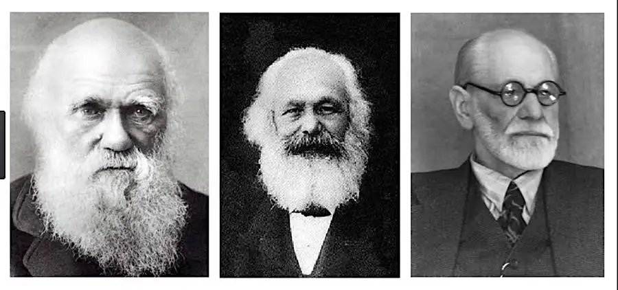
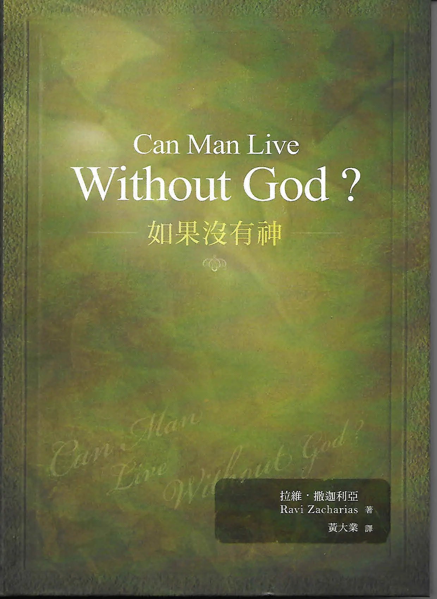

# 讽刺诗《（现代人的）信条》 - 史蒂夫·特纳

《（现代人的）信条》

作者：史蒂夫·特纳

翻译：张云轩

我们信仰马克思弗洛伊德达尔文。

我们相信一切都可行，

前提是别伤害任何人，

就是尽你所知，按着

你对伤害的定义即可。

我们信仰婚前、婚后，以及婚外的性行为。

我们信仰“罪恶娱乐疗法”。

我们相信红杏出墙别有生趣。

我们相信鸡奸也无伤大雅。

我们最忌讳把一些事当成忌讳。

我们相信万物都不断进步，

尽管有相反的证据。

你必须把这证据调查清楚，

毕竟你能用证据证明任何东西。

我们相信星座运势、外星飞碟、

念力弯勺都有个中奥秘。

耶稣是个好人，就像佛祖、

默罕默德和我们自己一样。

他是个不错的道德老师，

虽然我们认为他的道德教训差强人意。

我们相信所有宗教大同小异

至少我们所信的看来如此。

它们都追求爱和良善。

它们的差别不过在于创造、

罪、天国、地狱、上帝和救赎。

我们相信死后便是虚无，

因为你若去求问死人，

沉默便是他们的回答。

倘若死人向你撒了谎，倘若死亡并非终点，

那么天国必是众人的归宿，

也许除了

希特勒、斯大林和成吉思汗。

我们信仰Masters & Johnson 的性学研究。

研究对象挑选普通人，

普通的就是正常的，

正常的就是好的。

我们相信全面裁军，

我们相信战争和杀戮有直接联系。

美国人应该把他们的枪打成拖拉机，

而俄国人定会效仿。

我们相信人在本质上是好的，

只是他的行为让他失望。

这是社会的过错，

社会的过错乃是形势所迫，

形势的过错乃是社会所迫。

我们相信每个人都应该找到

自己眼中看为正确的真理。

现实会随之自圆其说，

整个宇宙会重新调整，

历史也会改头换面。

我们相信世上没有绝对的真理，

除了“没有绝对真理”这条真理。

我们信仰对诸般信条的摒弃，

要让个人思想百花齐放。

《机运》 – 后记

如果“机运”

是众生之父，

那么，灾难就是他在空中立约的彩虹，

而当你听到：

“全国戒备！

狙击手击毙十人！

军队残杀平民！

白人屠杀劫掠！

学校遭炸弹袭击！”

此乃人膜拜造他的主

所发出的声音。

\\_\\_\\_\_\_\_\_\_\_\_\_\_\_\_\_\_\_\_\_\_

史蒂夫·特纳（Steve Turner）, 英国记者， 《信条》一诗写于1993年，是他对现代思想的讽刺诗

该诗引用自拉维‧撒迦利亚（Ravi Zacharias）的书

Creed

by Steve Turner

We believe in Marxfreudanddarwin
We believe everything is OK
as long as you don't hurt anyone
to the best of your definition of hurt,
and to the best of your knowledge.

We believe in sex before, during, and after marriage.
We believe in the therapy of sin.
We believe that adultery is fun.
We believe that sodomy’s OK.
We believe that taboos are taboo.

We believe that everything's getting better
despite evidence to the contrary.
The evidence must be investigated
And you can prove anything with evidence.

We believe there's something in horoscopes
UFO's and bent spoons.
Jesus was a good man just like Buddha,
Mohammed, and ourselves.
He was a good moral teacher
although we think His good morals were bad.

We believe that all religions are basically the same-
at least the one that we read was.
They all believe in love and goodness.
They only differ on matters of creation,
sin, heaven, hell, God, and salvation.

We believe that after death comes the Nothing
Because when you ask the dead what happens
they say nothing.
If death is not the end, if the dead have lied, then its
compulsory heaven for all
excepting perhaps
Hitler, Stalin, and Genghis Kahn

We believe in Masters and Johnson
What's selected is average.
What's average is normal.
What's normal is good.

We believe in total disarmament.
We believe there are direct links between warfare and bloodshed.
Americans should beat their guns into tractors .
And the Russians would be sure to follow.

We believe that man is essentially good.
It's only his behavior that lets him down.
This is the fault of society.
Society is the fault of conditions.
Conditions are the fault of society.

We believe that each man must find the truth
that is right for him.
Reality will adapt accordingly.
The universe will readjust.
History will alter.
We believe that there is no absolute truth
excepting the truth
that there is no absolute truth.

We believe in the rejection of creeds,
And the flowering of individual thought.

"Chance" a post-script

If chance be
the Father of all flesh,
disaster is his rainbow in the sky
and when you hear

State of Emergency!
Sniper Kills Ten!
Troops on Rampage!
Whites go Looting!
Bomb Blasts School!

It is but the sound of man
worshipping his maker.

\\_\\_\\_\_\_\_\_\_\_\_\_\_\_\_\_\_\_\_\_\_

Steve Turner, (English journalist), "Creed," his satirical poem written in 1993 on the modern mind.
Taken from Ravi Zacharias’ book, Can Man live Without God?, Pages 42-44

"Can Man Live Without God?" The answer is "No!"...But we try all the time....

