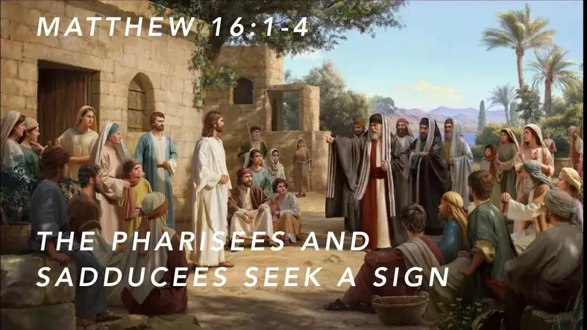
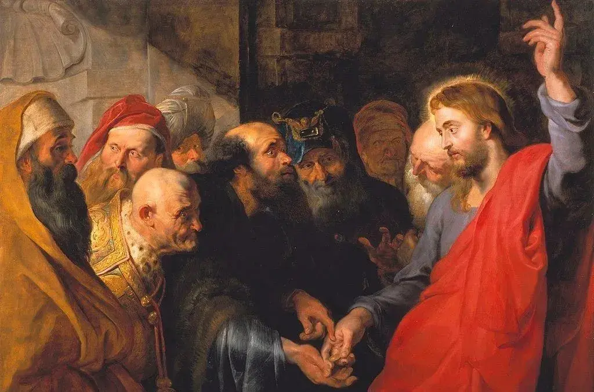
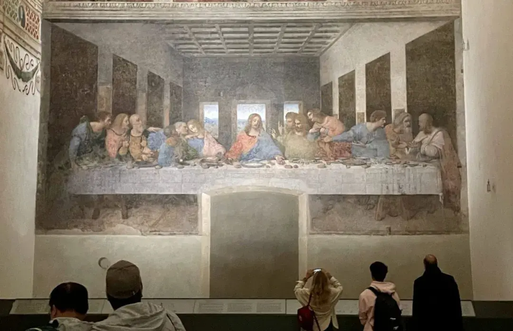
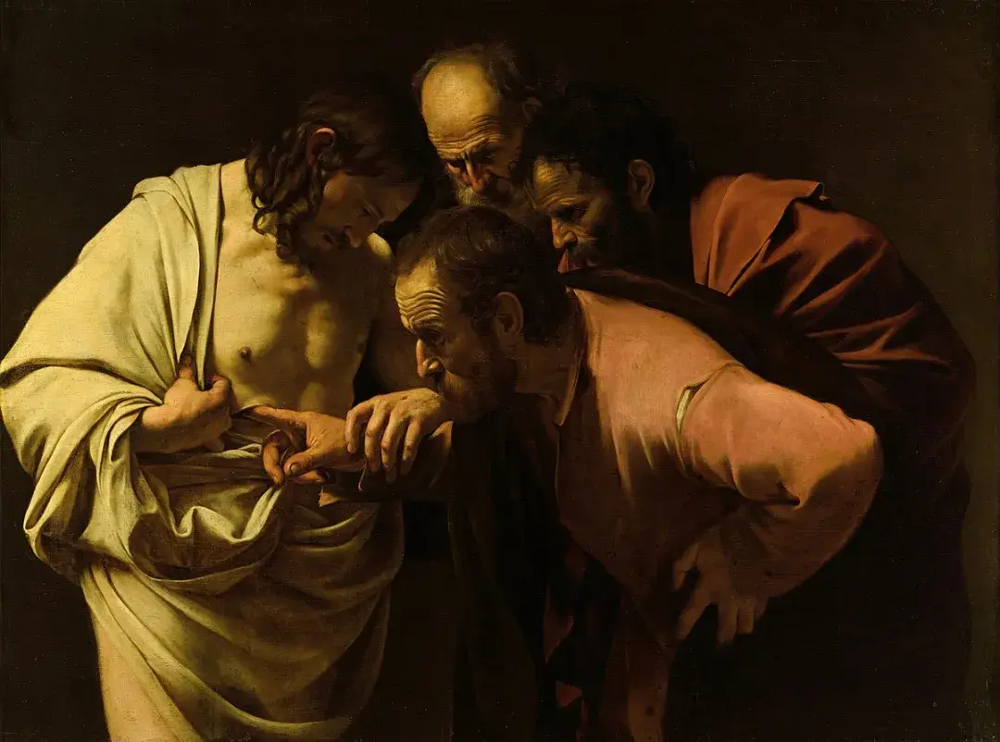

# 基督教缔造的六个现代观念

假如耶稣基督未曾来过这个星球，现代世界将截然不同。

众所周知，基督教对西方文明乃至现代文明，有着至关重要的影响。但是越是熟悉的，往往越是陌生的。
很多人对基督教的理解，只停留在了“三大宗教之一”、“爱人如己”等。 事实上，基督教真正独特、伟大的地方，在于其重塑心灵的力量，在于对人类思维方式，乃至世界观的六大改造。

**一：世界有规律**

现代人普遍相信，世界有统一的、客观的规律。这是科学、道德、文明存在的前提。但其实，这种思维在古代非常稀缺。几大文明古国普遍信奉多神教，认为宇宙中存在多个主宰。

比如古代中国人，建房要拜土地，求雨要拜龙王，出海要拜妈祖，求子要拜送子观音……表面看，功能很齐全，但其实，要满足如此多的要求，会让信徒非常被动和矛盾。
更严重的是，倘若宇宙没有唯一的主宰，就意味着没有统一的“规律”，人就永远活在不确定中。
是基督教改变了这种混乱的世界观。它继承了犹太教的世界观：上帝是自有永有的独一真神、是造物主，对宇宙有着完全的权柄，统一的安排；所以宇宙必然存在统一的、恒定的规律。
基督教还将这种思维传遍了全世界：无论自然还是社会，背后都有上帝掌权；所以科学真理和道德准则，应该并行不悖，而不是相互敌对。

正是这样的世界观，才使得追求文明本质成为可能。

**二：个人有自由**

个人自由，是现代文明最核心的价值。人权、法治、市场、艺术等价值，都是从个人自由生长出来的。但是如此宝贵的精神，在古代也是普遍缺失的。
古埃及的法老自称是神，古中国的皇帝自称天子，这些“高贵”的特权者，掌控着普通人的行动和生死。
即便是古希腊城邦，也缺少个人的自由。比如斯巴达士兵不能自由地看望新娘，音乐家不能自由地改造乐器。

唯有基督教，从诞生之初就蕴含了个人自由的基因。
圣经记载，神仿照自己的形象造人。所以每个人都是高贵的、自由的。人要自我完善，就必须亲近神、模仿神。所以人应该自由地发现、选择和创造。
因为神造的是有自由意志的人。就连亚当和夏娃的堕落，都是自由选择的结果。神告知了选择的后果，但仍然给了人自由选择的机会。
所以，个人有自由，不是因为自由带来的好处，而是人之为人的本性和责任。可以说，个人自由，是基督教留给世界最重要的遗产之一。

**三：人类有原罪**

人性论，是思考一切社会、政治问题的大前提。
在各大文明古国，比如古希腊、古中国的主流思想，都是性善论，所以面对政府、社会的问题，总是倾向于改造人性、“道德教化”。
只有基督教始终坚持，“除了神人基督，人人生而有罪”。亚当因堕落远离了神，导致他的后裔也陷入了悖逆、嫉妒、凶杀等邪念和罪行。
只有依靠神人基督，才能脱离罪恶的捆绑，有资格分享神的生命和性情。

**正是基于“原罪与恩典”的思想，奥古斯丁、托马斯、洛克、孟德斯鸠、斯密等思想家，才提出了限制权力的政治理论。这一思想构成了西方“有限政治”的基石，成为了现代“分权制衡”的源泉。**
美国宪法之父麦迪逊的名言：如果人人都是天使，就不需要政府；如果组成政府的人都是天使，也不需要对政府施加法律、制度的限制。已经是现代政治文明的核心。
可见，基督教对政治文明影响与改造，作用巨大。

**四：社会有道德**

平等、友爱、宽容，如今已是全世界公认的道德规范。但其实，这些道德原则也不是古已有之、四海皆准。
古代社会普遍信奉丛林法则，放纵肉体欲望。比如古代中国施行连坐；犹太教、伊斯兰主张“以眼还眼、以牙还牙”。

古希腊、古罗马也因为道德沦丧、社会糜烂，最终走向了衰亡。
基督教的兴起，给西方带来了全新的社会风尚和道德伦理。耶稣反对同态复仇，要求人们爱仇敌；耶稣尊重妇女的人格，改变了男尊女卑的风气；耶稣和保罗是自食其力的劳动者，改变了“劳动可耻”的奴隶制思维；基督教反对通奸和乱伦，恢复了伦理尊严；反对杀人和弃婴，改变了蔑视生命的态度；主张扶持弱者，为平民兴办了最早的医院、学校……
基督教这样的道德理念，打破了血缘、国家和阶层的界限，让所有信徒都成为“神的儿女”，真正实现了天下大同。

**五：世俗有价值**

绝大多数宗教，都将世俗生活视为障碍或负担。宗教徒为了“到达彼岸世界”，要放弃世俗生活，甚至否认物理事实。
只有基督教是个例外。正如《基督教神学导论》所说，基督徒坚信，耶稣是唯一能够沟通神与人的“梯子”；他是“完全的神”，也是“完全的人”。这种“神性与人性的紧张平衡”，是基督教传承数千年的古训，带来了持久而长远的冲击。

基督徒不能鄙视物质世界和理性知识。因为耶稣也是被造的人、有限的人，受物理规则限制，需要学习知识，像正常人一样生活行动；在死而复活、肉体永生之后，耶稣仍然是人、永远是人。

所以，正确的人性生活不仅有价值，更是通往永生的必经之路。教会的使命就是带领信徒“以世俗的生活，联于永生的盼望。”

肯定此岸价值的理念，随着经院哲学、文艺复兴的兴起，鼓励人们探索科学、热爱艺术。路德、加尔文更是教导，要大胆地追求财富，以事业的成功见证神的拣选。

**六、历史有方向**

现代人普遍相信，历史、文明是有方向的，人类可以推动社会不断进步，不是历史命运的奴隶。

但是在古代社会，人们普遍相信，历史是循环的、混沌的。比如希腊哲学认为，世界是循环的；佛教认为，生死即转世轮回。所以面对现实世界的好与坏，其他文明常常无动于衷。

然而基督教的兴起，带来了革命性的史观，正如《基督教与西方文化》一书所说：
基督教相信，历史偶有相似，但总是持续向前的；世界有一个终极的结局，且与人类的命运紧密相关；基督重临之日，一切罪恶都将被清算，一切善行都将得奖赏。
所以基督教鼓励人们用科学理解世界，用技术推进历史。比如中世纪的科学研究、大学教育，都是从神学院开始的。基督教认为历史、文明有方向，改造此岸世界的勇气才得以诞生。

